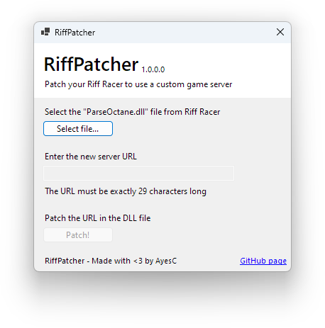

# RiffPatcher

RiffPatcher is a small self-contained tool that patches Riff Racer with a custom server for online features.

Simply download the latest release, select the `ParseOctane.dll` file from your installation of Riff Racer, enter the desired server URL, and hit patch.

For those looking to get started, a good server to begin with is the read-only archive of Riff Racer leaderboards at `http://riffapi.hobune.stream.`.

Note that the .NET 7 runtime needs to be present on your PC in order for the patcher to run, and is only compatible with x86-64 systems.